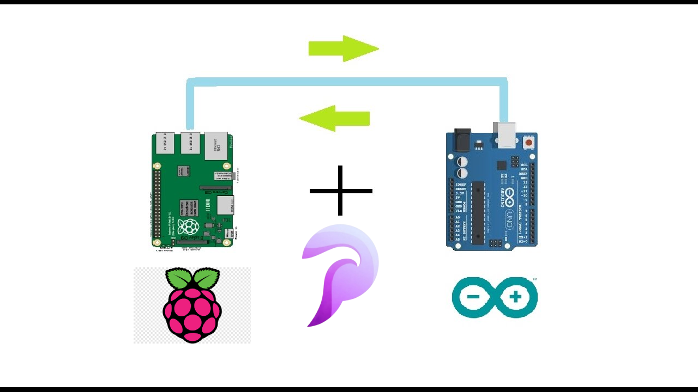

<h1 align="center">Welcome to the project Pearl OS! </h1>
<br />


<br />

# 
# Project: Peral OS - Arduino UNO Integration with Raspberry Pi

# About Peral OS

**Peral OS** is a project aimed at creating an operating system that integrates the capabilities of **Arduino UNO** and **Raspberry Pi** into a unified platform for automation and smart home applications. The project's goal is to achieve full integration of hardware and software solutions, ensuring flexibility and scalability with the ability to control devices and collect data from various sensors.

## Project Goals and Objectives

- **Integration of Arduino UNO and Raspberry Pi**: Development of software that enables Raspberry Pi to interact with Arduino UNO for controlling devices and collecting data from various sensors via serial communication.
  
- **Full integration with the operating system**: Development of a complete operating system that will run on Raspberry Pi and support interaction with the connected Arduino UNO, including device control (such as relays), sensor data reading, and communication between devices.

- **Software Development**: Creation of drivers and libraries to simplify working with Arduino within the integrated system, as well as developing a GUI interface for managing settings and monitoring the system.

- **Process Automation**: Development of an automatic response system based on sensor data (e.g., turning devices on/off based on temperature, humidity, and other factors) with the option for remote control via a web interface or mobile app.

- **Flexibility and Scalability**: Ensuring the ability to connect various sensors and actuators, as well as expanding the system with additional devices and modules.

## System Architecture

- **Raspberry Pi** will act as the central hub of the system, processing data, providing a web interface, and controlling all connected devices.
  
- **Arduino UNO** will be used to collect data from sensors and control actuators (e.g., relays for managing outlets, lights, and other devices).

- **Software** will include an operating system kernel, drivers for Arduino interaction, and a user interface for monitoring and managing the system.

## Technical Components of the Project
### 🛠 &nbsp;Languages and Tools :

<p>
&nbsp;
&nbsp;
&nbsp;
&nbsp;
&nbsp;
&nbsp;
&nbsp;
&nbsp;
&nbsp;
&nbsp;
</p>

---
- **Hardware Components**:
  - Raspberry Pi
  - Arduino UNO
  - Sensors (temperature, humidity, motion, and others)
  - Relays for controlling devices
  - Communication modules (e.g., Wi-Fi or Bluetooth)

- **Software Components**:
  - Python, C/C++
  - Arduino libraries (e.g., Firmata)
  - GUI interface based on Flask or Django for system management
  - Notification systems and data analytics

## Expected Outcomes

- A fully integrated platform where Raspberry Pi and Arduino work together as a unified system.
- The ability to remotely control the system via a web interface or mobile app.
- Automation and real-time device status monitoring.
- A flexible system supporting extensions and the addition of new sensors or actuators.


Project structure
```bash
Pearl OS/                        # Главная папка проекта
│
├── templates/                    # Папка для HTML-шаблонов
│   ├── accounts/                 # Шаблоны для приложения аккаунтов
│   │   ├── create-account.html   # Страница регистрации
│   │   └── login.html            # Страница логина
│   │
│   ├── pages/                    # Папка для отдельных статических страниц
│   │   ├── 404.html              # Страница ошибки 404
│   │   ├── blank.html            # Пустая страница
│   │   ├── buttons.html          # Страница с кнопками
│   │   ├── cards.html            # Страница с карточками
│   │   ├── charts.html           # Страница с графиками
│   │   ├── forms.html            # Страница с формами
│   │   ├── modals.html           # Страница с модальными окнами
│   │   └── tables.html           # Страница с таблицами
│   │
│   └── index.html                # Главная страница
│
├── static/                       # Папка для статических файлов
│   ├── assets/                   # Статические ресурсы (CSS, JS, изображения)
│   │   ├── css/                  # CSS файлы
│   │   │   ├── tailwind.css      # Основной CSS файл
│   │   │   └── tailwind.output.css # Скомпилированный CSS файл
│   │   │
│   │   ├── js/                   # JS файлы
│   │   │   ├── charts-bars.js    # Скрипт для диаграмм в виде столбцов
│   │   │   ├── charts-lines.js   # Скрипт для линейных диаграмм
│   │   │   └── charts-pie.js     # Скрипт для круговых диаграмм
│   │   │
│   │   └── img/                  # Изображения для проекта
│   │       ├── login-office.jpeg      # Изображение для страницы логина
│   │       ├── create-account-office.jpeg # Изображение для страницы регистрации
│   │       └── dashboard.png     # Изображение для панели управления
│
├── dashboard/                    # Приложение для основной панели управления
│   ├── __init__.py               # Инициализация приложения
│   ├── settings.py               # Настройки проекта
│   ├── urls.py                   # Главная конфигурация URL-ов
│   ├── wsgi.py                   # Для деплоя через WSGI
│   └── asgi.py                   # Для асинхронного деплоя
│
├── manage.py                     # Скрипт для управления проектом (миграции, запуск сервера и т.п.)

```
